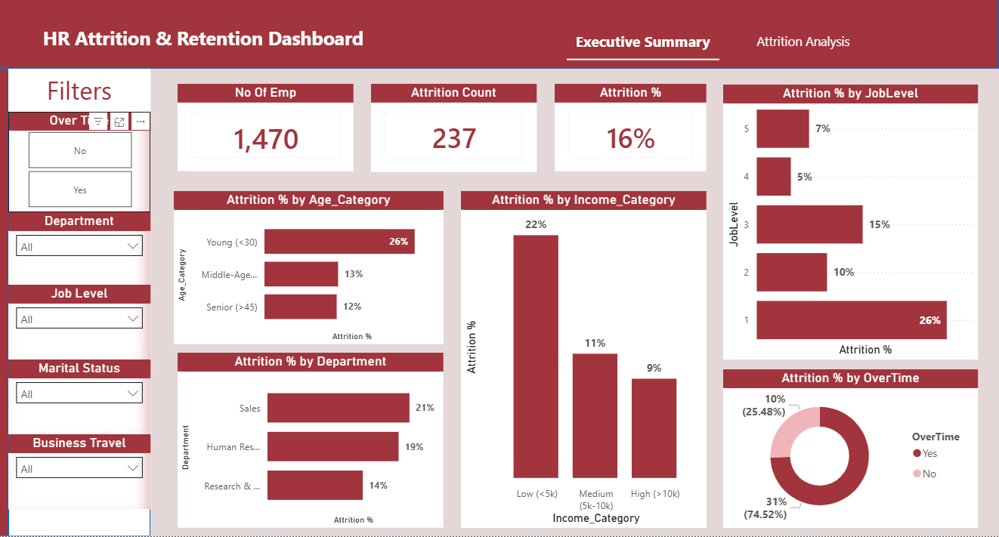

# IBM HR Analytics & Employee Attrition Tool 📊👥

An End-to-End Data Analysis project built to investigate employee attrition at IBM. This project combines **Python** (for Advanced EDA, Feature Engineering, and Data Cleansing) and **Power BI** (for Interactive Dashboarding and Root Cause Analysis) to provide actionable insights and data-driven recommendations for HR departments.

---

## 📊 Dashboard Preview

<p float="left">
  
  
</p>

---

## 📌 Project Overview
The primary goal of this project is to understand **why employees are leaving the company**. By analyzing an IBM HR dataset of 1,470 employees and 35 features, we uncovered hidden patterns relating to Overtime, Business Travel, and management relationships—especially among Junior employees and the Sales Department.

## 🛠️ Tech Stack & Workflow
1. **Data Cleansing & Validation (Python - Pandas & NumPy):** Removed redundant columns, checked for duplicates, verified there were no missing values or extreme outliers.
2. **Exploratory Data Analysis - EDA (Python - Matplotlib & Seaborn):** Conducted Univariate, Bivariate, and Multivariate analysis to map out age distributions, salary tiers, and initial correlations.
3. **Feature Engineering (Python):** Performed data Encoding and Binning (e.g., Age groups, Income brackets) to optimize the dataset for visualization.
4. **Interactive Dashboarding (Power BI):** Developed an intuitive dashboard showcasing KPIs, attrition rates, and deeper segmentations.
5. **Business Intelligence & Recommendations:** Formulated concrete strategic actions based on the dashboard findings.

---

## 🔍 Key Insights & Findings

* **The Overtime & Travel Trap:** Employees working Overtime are **3x more likely to leave** than those who don't. Attrition among frequent travelers is **25%**, which spikes to **42%** when combined with Overtime, and hits a staggering **70% for Junior employees**.
* **The Compensation & Promotion Disconnect:** Surprisingly, employees working overtime receive the same annual salary hikes and promotion rates as those who don't. Even worse, non-travelers enjoy slightly better promotion rates than frequent travelers.
* **The Sales Department Crisis:** The attrition rate among low-earning, overtime-working Junior sales employees who travel frequently climbs to **91%**. Furthermore, **100%** of Sales employees who haven't completed 2 years with their current manager tend to leave.
* **Manager Influence:** For vulnerable segments (Juniors, Overtime, low salary), having less than 2 years with their current manager increases the attrition probability from **70% to 75%**.

---

## 💡 Data-Driven Recommendations (Actionable Insights)

1. **Overtime & Travel Compensation:** Overhaul the compensation structure to directly tie heavy business travel and overtime hours to tangible rewards (e.g., performance bonuses, expedited promotion tracks, or monetary hikes).
2. **Protect Junior Talents:** Standardize workload distribution. Avoid overloading Junior employees (especially those with less than 2 years of tenure) with excessive overtime.
3. **Sales Department Management Review:** Investigate leadership dynamics within the Sales Department. Pair new sales hires with experienced mentors or conduct management training to mitigate the 100% turnover rate seen within the first two years of a manager relationship.

---

## 📊 DAX Measures Used
Here are some of the key DAX measures calculated to build the Power BI dashboard:

```dax
// Total number of employees who left
Attrition count = CALCULATE(COUNT(HR_Datasets_Cleaned[Attrition]), HR_Datasets_Cleaned[Attrition]="Yes")

// Attrition Rate Percentage
Attrition % = [Attrition count] / COUNT(HR_Datasets_Cleaned[Attrition])

// Average Annual Salary Hike Percentage
Avg PercentSalaryHike = AVERAGE(HR_Datasets_Cleaned[PercentSalaryHike])

// Average Years Since Last Promotion
Avg YearsSinceLastPormotion = AVERAGE(HR_Datasets_Cleaned[YearsSinceLastPromotion])
